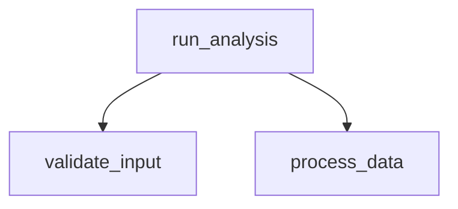

# New Features Implementation - Code Analysis & Documentation Quality Suite

This document describes the newly implemented code analysis and documentation quality features in AccuDoc.

## Overview

Four major features have been implemented to help developers understand, improve, and assess their codebases:

1. **Complexity Analysis** - Identifies complex code that needs documentation
2. **Best Practices Checker** - Detects coding standards violations
3. **Call Graph Generation** - Visualizes function relationships
4. **Documentation Completeness Score** - Rates documentation quality

## 1. Complexity Analysis

### Description
The Complexity Analyzer calculates cyclomatic complexity for functions to identify areas that need better documentation or refactoring.

### Features
- **Cyclomatic Complexity Calculation**: Analyzes control flow structures
- **High Complexity Detection**: Flags functions with complexity > 10
- **Undocumented Complex Functions**: Identifies complex functions without docstrings
- **Multi-Language Support**: Python (AST-based), JavaScript/TypeScript (regex-based)
- **Detailed Reporting**: Generates comprehensive reports with recommendations

### Usage

```python
from accudoc.complexity_analyzer import ComplexityAnalyzer

# Analyze repository
analyzer = ComplexityAnalyzer('/path/to/repo')
results = analyzer.analyze_repository(['.py', '.js'])

# Generate report
report = analyzer.generate_report(results)
print(report)
```

### Example Output
```
# Code Complexity Analysis Report

## Summary
- Total Files Analyzed: 3
- Total Functions: 7
- High Complexity Functions: 3
- Undocumented Complex Functions: 2

## High Complexity Functions (>10)
| File | Function | Complexity | Line |
|------|----------|------------|------|
| complex_module.py | process_data | 13 | 4 |
```

### Demo Script
Run `python3 demo_complexity.py` to see the analyzer in action.

## 2. Best Practices Checker

### Description
The Best Practices Checker examines code against common coding standards and identifies violations with severity levels.

### Features
- **Missing Docstrings**: Detects modules, classes, and functions without documentation
- **Function Design**: Checks for too many parameters (>5) or long functions (>50 lines)
- **Exception Handling**: Flags bare except clauses and broad exception catching
- **Code Style**: Checks line length (PEP 8 compliance at 120 chars)
- **Mutable Defaults**: Identifies dangerous mutable default arguments
- **Magic Numbers**: Detects hard-coded values that should be constants
- **Class Design**: Flags classes with too many methods (>20)
- **Severity Levels**: High, Medium, Low for prioritizing fixes

### Usage

```python
from accudoc.best_practices import BestPracticesChecker

# Check repository
checker = BestPracticesChecker('/path/to/repo')
results = checker.check_repository(['.py'])

# Generate report
report = checker.generate_report(results)
print(report)
```

### Example Output
```
# Best Practices Check Report

## Summary
- Total Files Checked: 3
- Files with Violations: 2
- Total Violations: 61
- High Severity: 2
- Medium Severity: 32
- Low Severity: 27

## High Severity Violations
| File | Line | Type | Message |
|------|------|------|---------|
| bad_code.py | 12 | mutable_default_argument | Function uses mutable default |
| bad_code.py | 9 | bare_except | Bare except clause found |
```

### Checks Performed

#### High Severity
- Bare except clauses (catches all exceptions)
- Mutable default arguments (common Python pitfall)

#### Medium Severity
- Missing module/class/function docstrings
- Too many function parameters (>5)
- Functions too long (>50 lines)
- Classes with too many methods (>20)
- Broad exception catching

#### Low Severity
- Magic numbers (hard-coded values)
- Lines too long (>120 characters)

### Demo Script
Run `python3 demo_best_practices.py` to see the checker in action.

## 3. Call Graph Generation

### Description
The Call Graph Generator analyzes function call relationships to help understand code flow and dependencies.

### Features
- **AST-Based Analysis**: Accurate parsing of Python code
- **Function Relationships**: Tracks who calls what
- **Class Method Support**: Handles object-oriented code
- **Caller/Callee Lookup**: Find all functions that call or are called by a function
- **Mermaid Diagrams**: Generates visual call graphs
- **Dependency Analysis**: Identifies most called functions and those with most dependencies
- **Multi-File Support**: Builds complete call graph across repository

### Usage

```python
from accudoc.call_graph import CallGraphGenerator

# Generate call graph
generator = CallGraphGenerator('/path/to/repo')
call_graph = generator.analyze_repository(['.py'])

# Find callers and callees
callers = generator.find_callers('my_function', call_graph)
callees = generator.find_callees('my_function', call_graph)

# Generate report with Mermaid diagram
report = generator.generate_report(call_graph)
print(report)
```

### Example Output
```
# Call Graph Analysis Report

## Summary
- Total Functions: 19
- Total Classes: 2
- Total Call Relationships: 24

## Most Called Functions
| Function | Times Called |
|----------|--------------|
| log_message | 2 |
| validate_input | 1 |

## Call Graph Visualization

```

### Demo Script
Run `python3 demo_call_graph.py` to see the generator in action.

## 4. Documentation Completeness Score

### Description
The Completeness Scorer calculates an overall documentation quality score (0-100) with letter grades, identifying gaps and providing actionable recommendations.

### Features
- **Multi-Category Analysis**: Evaluates 9 documentation aspects
- **README Quality Check**: Validates essential sections (installation, usage, features, etc.)
- **Code Documentation**: Analyzes docstrings for modules, classes, and functions
- **File Detection**: Checks for LICENSE, CONTRIBUTING, CHANGELOG, examples
- **Weighted Scoring**: Different weights for different categories
- **Letter Grades**: A-F grading system
- **Gap Identification**: Categorizes issues as critical, important, or optional
- **Visual Reports**: Score bars and detailed breakdowns
- **Summary Metrics**: Quick overview of documentation health

### Scoring Categories

| Category | Weight | Description |
|----------|--------|-------------|
| README | 25% | Completeness of README file |
| Code Documentation | 30% | Docstrings coverage |
| Comments | 10% | Inline code comments |
| API Documentation | 10% | API docs presence |
| License | 5% | LICENSE file |
| Contributing | 5% | CONTRIBUTING guide |
| Changelog | 5% | CHANGELOG file |
| Examples | 5% | Example/demo files |
| Config Docs | 5% | Config documentation |

### Usage

```python
from accudoc.completeness_score import CompletenessScorer

# Analyze repository
scorer = CompletenessScorer('/path/to/repo')
results = scorer.analyze_repository()

# View overall score
print(f"Score: {results['overall_score']}/100 (Grade: {results['grade']})")

# Generate full report
report = scorer.generate_report(results)
print(report)
```

### Example Output
```
# Documentation Completeness Report

## Overall Score
**Score: 72.0/100** (Grade: **C**)

```
██████████████░░░░░░ 72.0%
```

## Summary
- Total Files: 7
- Critical Gaps: 0
- Important Gaps: 0
- Optional Gaps: 0

## Category Scores
| Category | Score | Status |
|----------|-------|--------|
| README | 100.0% | ✅ |
| Code Documentation | 100.0% | ✅ |
| Comments | 0.0% | ❌ |
```

### Gap Severity Levels

- **Critical**: Essential for project usability (README, code documentation)
- **Important**: Highly recommended (LICENSE, key sections)
- **Optional**: Nice to have (examples, CHANGELOG, CONTRIBUTING)

### Demo Script
Run `python3 demo_completeness_score.py` to see the scorer in action.

## Testing

All features include comprehensive test suites:

- **test_complexity_analyzer.py**: 8 tests covering complexity calculation
- **test_best_practices.py**: 13 tests covering all check types
- **test_call_graph.py**: 10 tests covering call graph generation
- **test_completeness_score.py**: 14 tests covering documentation scoring

Run tests with:
```bash
python3 test_complexity_analyzer.py
python3 test_best_practices.py
python3 test_call_graph.py
python3 test_completeness_score.py
```

All tests pass successfully! ✅ (45 total tests)

## Integration with AccuDoc

These features can be integrated into AccuDoc's documentation generation process:

1. **Complexity warnings** can be added to API documentation
2. **Best practices violations** can be included in quality reports
3. **Call graphs** can be embedded in architecture documentation
4. **Completeness scores** can be shown in project dashboards

## Summary

These four features provide powerful code analysis and documentation quality capabilities:

- **Complexity Analysis**: Helps identify code that needs refactoring or documentation
- **Best Practices Checker**: Ensures code quality and maintainability
- **Call Graph Generation**: Visualizes code structure and dependencies
- **Completeness Score**: Objectively measures documentation quality

Together, they help developers:
- Understand complex codebases
- Maintain code quality
- Identify areas needing improvement
- Generate better documentation
- Track documentation improvements over time

All features are production-ready with comprehensive tests and demo scripts.
