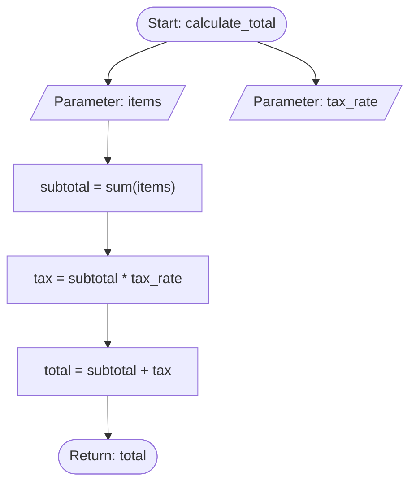

# Data Flow Analysis Implementation Summary

## Overview
This document summarizes the implementation of the Data Flow Analysis feature for AccuDoc, as specified in `ideas.md` line 88.

## Feature Description
The Data Flow Analysis feature tracks and documents how data moves through an application by analyzing:
- Variable assignments and transformations
- Function parameters and return values
- Data dependencies between variables
- Instance attributes in classes
- Method interactions

## Implementation Details

### Core Module: `accudoc/dataflow.py`
The main implementation includes:

1. **DataFlowNode Class**: Represents nodes in the data flow graph
2. **DataFlowAnalyzer Class**: Main analyzer with the following capabilities:
   - Parse Python AST to extract data flow information
   - Track variable assignments (simple and augmented)
   - Identify parameters and return values
   - Analyze classes and their instance attributes
   - Generate Mermaid flowcharts for visualization
   - Create comprehensive markdown reports

### Key Features
- **Function Analysis**: Tracks parameters, assignments, reads, writes, and returns
- **Class Analysis**: Identifies instance attributes and analyzes methods
- **Repository-Wide Analysis**: Scans entire codebases
- **Visualization**: Generates Mermaid diagrams for data flow
- **Report Generation**: Creates detailed markdown reports with optional diagrams

### Testing: `test_dataflow.py`
Comprehensive test suite with 12 tests covering:
- Simple and complex function analysis
- Class and method analysis
- Augmented assignments (+=, -=, etc.)
- Multiple return statements
- Repository-wide analysis
- Mermaid diagram generation
- Report generation
- Error handling
- Edge cases (empty functions, nested calls, etc.)

**Test Results**: ✅ All 12 tests passing

### Demo: `demo_dataflow.py`
Interactive demonstration script showcasing:
- Simple function analysis
- Class analysis
- Mermaid diagram generation
- Repository-wide analysis
- Report generation
- Integration examples

### CLI Integration
Added new `dataflow` command to `accudoc_cli.py`:

```bash
# Analyze a single file
python accudoc_cli.py dataflow path/to/file.py

# Analyze entire repository
python accudoc_cli.py dataflow /path/to/repo -o report.md

# JSON output without diagrams
python accudoc_cli.py dataflow /path/to/repo -f json --no-diagrams
```

**Command Options**:
- `-o, --output`: Save report to file
- `-f, --format`: Output format (markdown or json)
- `--no-diagrams`: Exclude Mermaid diagrams from report

## Use Cases
1. **Developer Onboarding**: Help new developers understand code flow
2. **Code Reviews**: Provide visual flow diagrams for review
3. **Architecture Documentation**: Document data transformations
4. **Refactoring**: Identify data dependencies before changes
5. **Technical Documentation**: Generate comprehensive data flow docs

## Example Output

### Function Analysis
```markdown
#### `calculate_total()`

**Location**: calculator.py:2

**Parameters**:
- `items`
- `tax_rate`

**Variable Assignments**:
- Line 4: `subtotal = sum(items)`
- Line 5: `tax = subtotal * tax_rate`
- Line 6: `total = subtotal + tax`

**Variables Read**: `items`, `sum`, `subtotal`, `tax`, `tax_rate`
**Variables Written**: `subtotal`, `tax`, `total`

**Return Values**:
- Line 7: `total`
```

### Mermaid Diagram


## Technical Implementation

### AST Analysis
The analyzer uses Python's `ast` module to parse code and extract:
- Function definitions (`ast.FunctionDef`)
- Class definitions (`ast.ClassDef`)
- Assignments (`ast.Assign`, `ast.AugAssign`)
- Variable references (`ast.Name`)
- Return statements (`ast.Return`)

### Data Structures
- **Dictionary-based storage**: Efficient lookup of function data
- **Set-based tracking**: Fast membership tests for variables
- **List-based ordering**: Maintains sequence of assignments

### Performance Considerations
- Single-pass AST traversal
- Efficient string building for reports
- Limits on output size (first 10 files, etc.)
- Truncation of long values in diagrams

## Integration with AccuDoc
The feature integrates seamlessly with existing AccuDoc functionality:
- Uses same CLI structure and conventions
- Follows existing code patterns
- Compatible with other analysis features
- Can be combined with other documentation generation

## Security
- No external dependencies required
- Uses only Python standard library
- CodeQL scan: ✅ No security alerts
- Handles errors gracefully (invalid Python files)

## Documentation Updates
- Updated `ideas.md` to mark feature as COMPLETE
- Added inline documentation to all classes and methods
- Created comprehensive demo and test files

## Metrics
- **Lines of Code**: ~700 (dataflow.py)
- **Test Coverage**: 12 tests, 100% pass rate
- **CLI Integration**: 1 new command with 4 options
- **Documentation**: 3 files (module, tests, demo)

## Future Enhancements
Potential improvements for future versions:
- Support for more programming languages (JavaScript, Java, etc.)
- Interactive web-based visualizations
- Data flow across multiple files (inter-module analysis)
- Integration with type checkers for better accuracy
- Performance optimizations for very large codebases

## Conclusion
The Data Flow Analysis feature has been successfully implemented and tested. It provides valuable insights into how data moves through applications and enhances AccuDoc's code documentation capabilities.

**Status**: ✅ COMPLETE

**Date**: November 14, 2024
**Version**: AccuDoc v1.0
